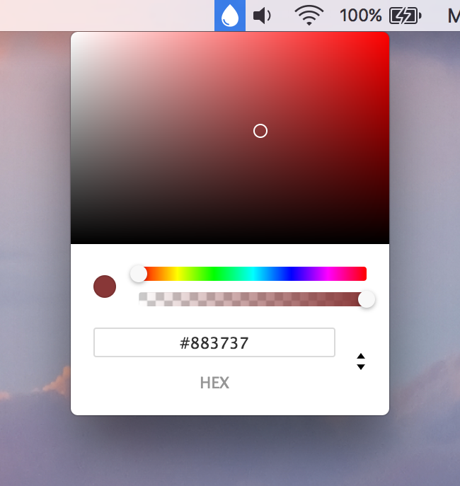

#  Tint

**NOTE: This is currently in beta and may break! If it does, please create an issue!**

A not-so-sucky color picker status bar for OSX.




## Download

**[Download the latest release here](https://github.com/adaringdesign/tint/releases)**


## Features

- Support opacity and hue.
- Supports HEX, RGBA and HSLA.
- Local shortcut (`Command(⌘) + C`) to copy color value.
- Local shortcut (`Command(⌘) + V`) to paste a color value into Tint.
- Supports Dark Mode.
- Launch at login.

Something else you'd like to see? Create an issue!


## Usage

Upon first launch Tint will automatically ask you if you'd like to move the app to the Applications folder if you hadn't installed it there already. Currently, Tint wil launch when you login or (re-)start the system.

Once Tint is running, simply click the icon in the menu bar to open the color picker. Drag the circle within the hue specrum to select a color. Drag the first slider to adjust the hue and the second to adjust the opacity. 

Note: `HEX` values don't support opacity, if `HEX` is selected it will revert to `RGBA` by default.

By default, Tint will return a `HEX` value. You can toggle between `HEX`, `RGBA` and `HSLA` by clicking on the arrows in the bottom-right corner.

Once you are happy with your selected color either click the little orb next to the sliders on the left, or hit `Command(⌘) + C` to copy the color value. Tint will quickly display  `⌘V` to let you know that you can past the value anywhere with the command `Command(⌘) + V`

If you already have a color value that you would like to adjust using Tint, simply copy the value and paste it into Tint with `Command(⌘) + V`. If the value is valid, Tint wil recognise, parse and load the value so it can be adjusted.


## Development

> Want to help make Tint even better?

Tint is developed using [Electron](http://electron.atom.io/) and [Node.js](https://nodejs.org/en/) which enables writing native-like applications using JavaScript.

Pre-reqs:

- Node v5.0.x:

```shell
# On a mac with Homebrew:
brew install nvm

nvm install
nvm use
npm install
```

- Electron:

```shell
# Install electron
npm install --global electron
```

Don't install electron-prebuild! Please see [Stackoverflow](http://stackoverflow.com/questions/41574586/what-is-the-difference-between-electron-and-electron-prebuilt) for an explaination why. 

- Dependencies:
```shell
# Install dependencies prior to running
npm install
```


### Run

Run without compiling a new app:

```shell
npm start
```


### Build

Build a `Tint.app` file:

```shell
npm run package
```


## To Do:

- [ ] Minor ui fixes
- [x] Add input shortcut (`Command(⌘) + V`)
- [ ] Add preferences dialog
      - [ ] Implement launch at login settings
- [x] ~~Fix **React-color** modification/hack~~
      - [x] Replace with Tinycolor & Spectrum
- [ ] (Auto)update from github release
      - [ ] Update notification
      - [ ] Update settings in preferences
- [ ] Improve initializing speed
- [ ] Support more color formats/modes
      - [ ] Implement user preferred color format/mode setting
      - [ ] Implement CMYK support - WIP
- [ ] Implement an actual color picker to select colors based on pixel values from the screen


## Known issues

- ~~**React-color** module is modified modification/hack.~~
  - ~~A main dependency is the **React-color** module, in the current release this module includes a custom modification to make it suite my needs. Please keep in mind that this modified version is currently not included within this repo as it resambles a rather dirty hack and needs to get implemented properly first!~~
- No blur event triggered on `esc`
  - Reason: no shortcut has been implemented yet.


## Change log

##### 2.1.0: Second beta

- Moved away from React
- Now build on top of [Tinycolor](https://github.com/bgrins/TinyColor) & [Spectrum](https://github.com/bgrins/spectrum)
- Added some features:
  - Pasting color values into Tint (`Command + V`)
- Tweaked the ui, color spectrum is slightly bigger now


##### 2.0.1: Initial release - beta

- Updated some dependencies
- Added some features
- Changed the ui


## Credits

Updated by Rutger Valk-van de Klundert © 2017. Released under an MIT license.

[Brian Grinstead](https://github.com/bgrins) - [Tinycolor](https://github.com/bgrins/TinyColor) & [Spectrum](https://github.com/bgrins/spectrum)

Started by Dana Woodman in < 2015.

Icon "tint" by useiconic.com from the Noun Project.